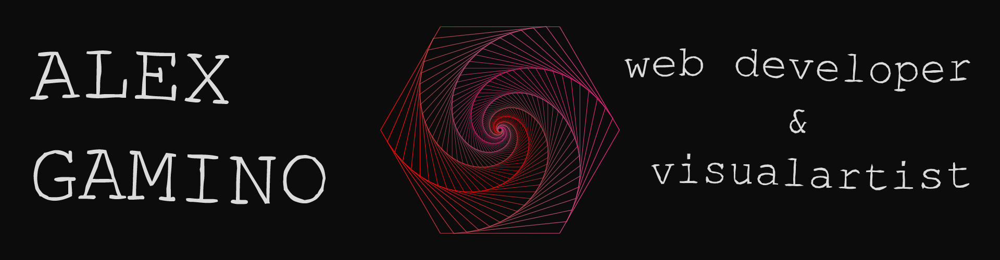

<p><em>Remote Full-stack web developer ready for adventure</em></p>

I'm a web developer who is passionate about making contributing to open-source more approachable, creating technology to elevate people, and building community. Some technologies I enjoy working with include ReactJS, Jamstack (JavaScript, APIs + Markup) and React

[](https://www.linkedin.com/in/alex-gamino-81aab3214/)

###  A little more about me...  

```javascript
const alexGamino = {
  lookingFor: "Front-end developer" || "Full-stack web developer",
  pronouns: ["he", "his"],
  code: [JavaScript, React, Redux, Ruby on Rails, HTML/CSS, Semantic UI, Bootstrap, 
  Tailwind CSS],
  askMeAbout: [Cooking, The Weeknd, painting, creative coding],
  challenge: "I am honing my React skills and picking up Vue",
  funFacts: ['I have 2+ years of remote work experience with devs 
  from all over the world', 
  'I have a collection of teddy bears from different countries']
}
```
[](https://github.com/anuraghazra/github-readme-stats)

[](https://github.com/anuraghazra/github-readme-stats)

<a href="https://github.com/AlexHamn/github-readme-stats">
  
</a>
<a href="https://github.com/AlexHamn/convoychat">
  
</a>


<!--
**AlexHamn/AlexHamn** is a ✨ _special_ ✨ repository because its `README.md` (this file) appears on your GitHub profile.

Here are some ideas to get you started:

- 🔭 I’m currently working on ...
- 🌱 I’m currently learning ...
- 👯 I’m looking to collaborate on ...
- 🤔 I’m looking for help with ...
- 💬 Ask me about ...
- 📫 How to reach me: ...
- 😄 Pronouns: ...
- ⚡ Fun fact: ...
-->
